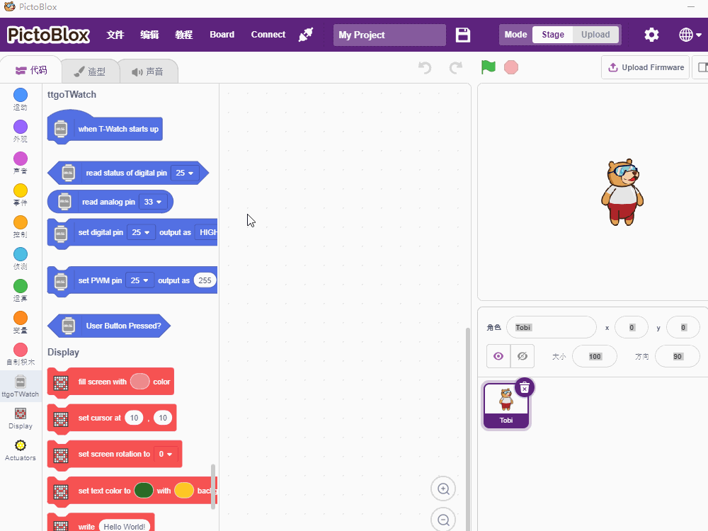

=============
Get started 
=============

This document is intended to guide users on how to install PictoBlox programming software, 
as well as basic operations

One. Environment construction
==================================

Steps
+++++++++++++
* :ref:`get-stared-download`
* :ref:`get-stared-install`

.. _get-stared-download:

1. Software download
==============

1.1 Download
+++++++++++++++++++++++++

+-------------------+-------------------+-------------------+
| |windows-logo|    | |linux-logo|      | |macos-logo|      |
+-------------------+-------------------+-------------------+
| `Windows`_        | `Linux`_          | `Mac OS`_         |
+-------------------+-------------------+-------------------+

.. |windows-logo| image:: ../_static/windows-logo.png
    :target: ../basics/windows-setup.html

.. |linux-logo| image:: ../_static/linux-logo.png
    :target: ../basics/linux-setup.html

.. |macos-logo| image:: ../_static/macos-logo.png
    :target: ../basics/macos-setup.html

1.2 Official website download
++++++++++++++++++++++++++++++++

login `Pictoblox <https://thestempedia.com/product/pictoblox/download-pictoblox/>`_ Select the software version corresponding to the operating system

.. figure:: ../_static/pic4.png
   :scale: 60
   :align: center

.. _get-stared-install:

2. Software Installation
==============================

Two. Quick start
=====================
1. Open the software
=========================

.. note::
    Double-click the Pictoblox icon on the desktop to run the software.

2.Connection operation
=========================

2.1 Select the development board type
+++++++++++++++++++++++++++++++++++++++
.. figure:: ../_static/pic4.gif
   :scale: 70
   :align: center

.. note::
    Click ``board'' in the menu bar, then select ``T-Watch`` 

2.2 USB connection T-watch
+++++++++++++++++++
.. image:: ../_static/model2.jpg
.. note::
    Use the Type-C data cable to connect to the Type-C interface of T-Watch, as shown above, on the ``right side'' of the watch  

2.3 Select port
+++++++++++++++++++

.. note::
    Click ``Connect`` in the menu bar, and then select the generated ``COMXX``  

3. Upload program 
=============

3.1 Choose blocks
++++++++++++++++++++++

3.2 Adjustment parameter
+++++++++++++++++++++++++++++
.. figure:: ../_static/pic7.gif
   :scale: 70
   :align: center

3.3 Upload program
+++++++++++++++++
.. figure:: ../_static/pic8.gif
   :scale: 70
   :align: center

3.4 normal run
+++++++++++++++++