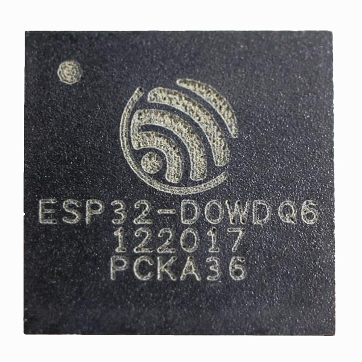
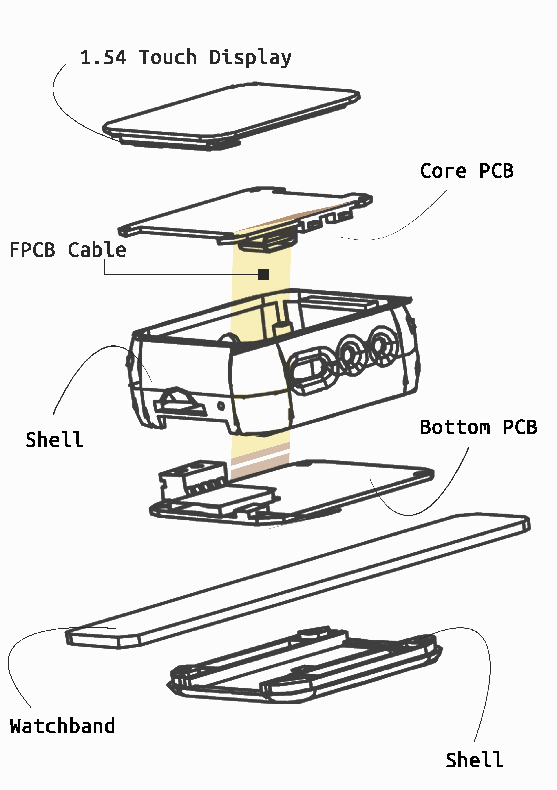
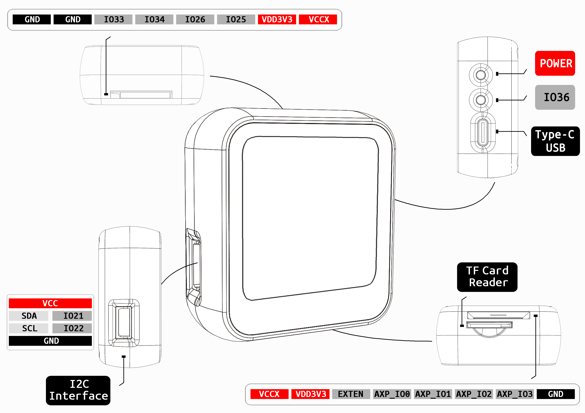

==============
Introduction
==============

Software Overview
==================

.. figure:: ../_static/zz.png
   :scale: 50
   :align: left

PictoBlox is a graphical programming software based on Scratch 3.0, and is an ideal companion to the first step in the programming world.
Its user-friendly interface and drag-and-drop function eliminate the need to store syntax and rules, which is often encountered in traditional programming languages,
And often make children feel afraid and make them hesitate. As a result, they only need to focus on the problem at hand and develop skills such as logical reasoning and problem solving,
This is an essential skill in today's technology-driven world.

.. figure:: ../_static/t-quick1.gif
   :scale: 140
   :align: center

.. note::
  Scratch is a computer program development platform developed by MIT,
  Designed to enable beginners of programming languages to design products without having to learn language grammar first.
  Developers expect to learn Scratch,
  Inspire and motivate users to learn programming, mathematics and computing knowledge through operations (such as designing interactive stories) in a pleasant environment,
  At the same time get creative thinking, logic programming, and collaborative working experience.

.. figure:: ../_static/start2.png
   :scale: 100
   :align: center

category
==============

category
--------------

* :ref:`technical-parameters`
* :ref:`appearance-specification`
* :ref:`component-layout`
* :ref:`pin-definition`

.. _technical-parameters:

1.Technical Parameters
==========================

- T-Watch Onboard：

  - Main chip: ESP32
  - 1.54 inch LCD capacitive touch screen: ST7789V
  - Touch screen chip: FT6236U
  - Three-axis accelerometer: BMA423
  - PMU power management: AXP202
  - RTC clock module: PCF8563
  

- **ESP-32** Master：

 - CPU: Xtensa dual-core 32-bit LX6 microprocessor, operating frequency is 240 MHz, up to 600 DMIPS
 - Ultra Low Power (ULP) coprocessor
 - Memory: 520 KiB SRAM
 - wireless connection:
 - Wi-Fi: 802.11 b/g/n
 - Bluetooth: v4.2 BR/EDR and BLE
 
- Power supply: Type-C USB/lithium battery
- Working voltage: 3.3V

.. note::
  
  ESP32 was created and developed by Shanghai-based Chinese company Espressif Technology, and manufactured by TSMC using 40-nanometer technology.
  It is the successor to the ESP8266 microcontroller.

.. _appearance-specification:

2.Appearance specifications
=============================

.. _component-layout:

3.Component layout
====================

.. image:: ../_static/model3.jpg
.. _pin-definition:

4.Pin definition
==================

.. image:: ../_static/model4.jpg
